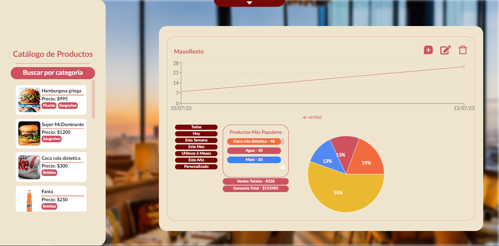
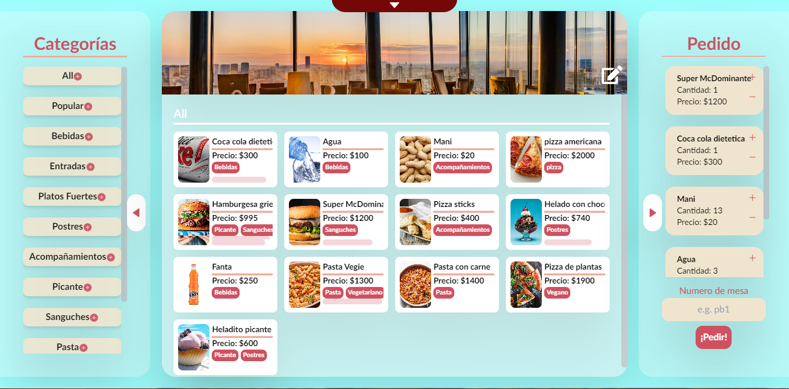
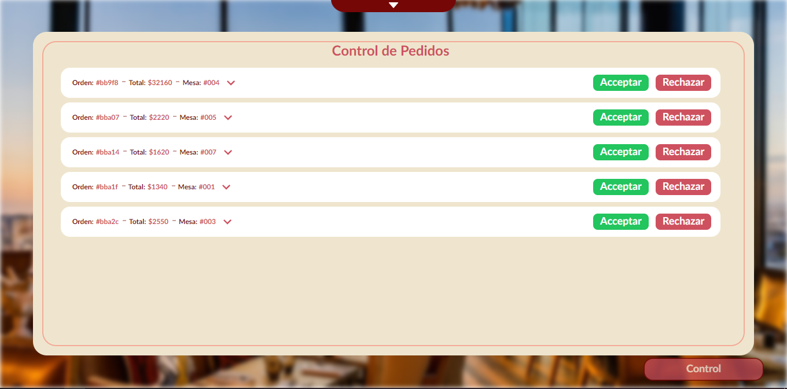
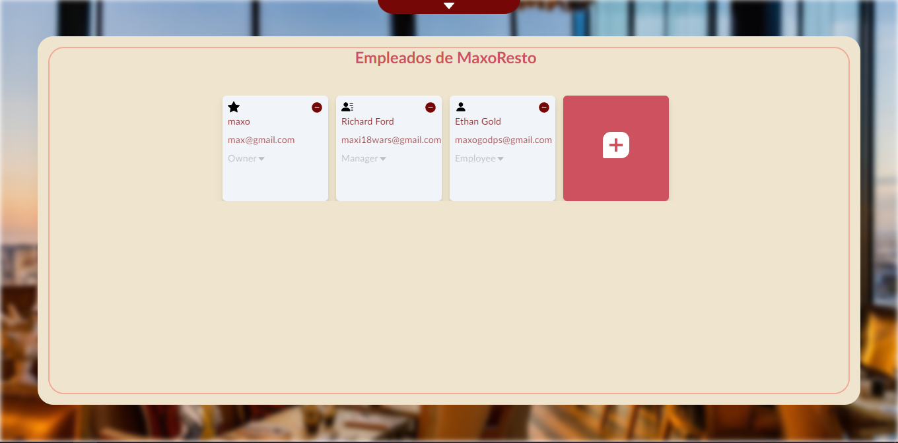

# AlaCarta

## Made by [maxo](https://github.com/maxogod), [santi](https://github.com/SantiSev), [fran](https://github.com/FranGuti)

Alacarta is a backoffice fullstack web app for managing restaurants with the following features:

* Register a restaurant
* Add/edit/delete products for the menu
* Edit menu appearance by changing color and banner
* Edit/delete restaurant
* Customers can make orders from the page
* Employees can manage incoming orders and accept/deny the order
* Owner and managers can see the sales data in a (sales/time) line chart, or see the most popular products in a pie chart
* Filter product by category (in both menu and dashboard)
* Owners can add new managers/employees, and managers can add new employees to the staff with just their email
* Users that are registered in a restaurant by a manager/owner and dont have an account yet will receive an email with a unique code to create their account with email, name and password
* All users will have their list of active restaurants in their homepage

## Stack

* Node + Express
* React + Redux + Tailwind
* MongoDB

## How To Run

create a .env file in both backend and frontend directories:

* backend/.env

```raw
  DEV_PORT=<port like 8080>
  SESSION_SECRET=<for encrypting session cookies>
  MONGO_URI=<mongo atlas uri or local mongo db>
  MAIL=<google email>
  PASS=<your google account "app password">
  FRONTEND_URL=<your frontend url like http://localhost:3001>
```

* frontend/.env

```raw
VITE_API_URL=<backend url like http://localhost:8080>
```

The following commands have to be run in two separate terminals

```bash
cd /backend; npm install; npm run dev
cd /frontend; npm install; npm run dev
```

Open localhost:3001 (not 127.0.0.1:3001) to see the page and you are done!

## Images

### Homepage


### Dashboard



### Menu



### Orders



### Employees


